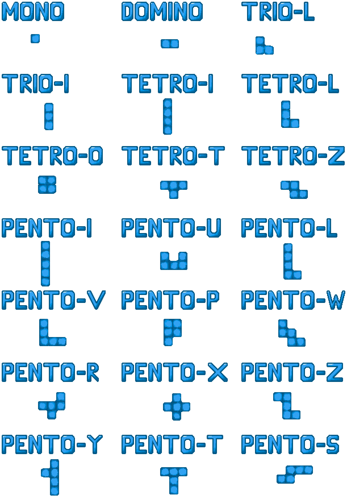
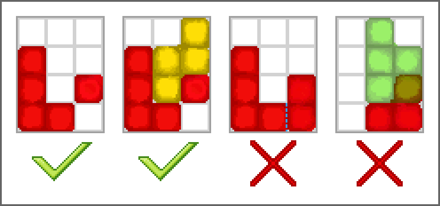

[PDF-Version dieses Dokumentes](regeln.pdf)

Wir freuen uns über sämtliche Verbesserungsvorschläge.  
Die Dokumentation kann [direkt auf
GitHub](https://github.com/software-challenge/docs) editiert werden,
einzige Voraussetzung ist eine kostenlose Registrierung bei GitHub. Ist
man angemeldet, kann man ein Dokument auswählen (ein guter Startpunkt
ist die Datei
[index.md](https://github.com/software-challenge/docs/blob/main/index.md)
welche Verweise auf alle Sektionen der Dokumentation enthält) und dann
auf den Stift oben rechts klicken. Damit wird von GitHub automatisch ein
Fork und ein Pull Request erstellt.  
Alternativ auch gern eine E-Mail an <info@software-challenge.de> oder
eine Nachricht im [Discord](https://discord.gg/jhyF7EU).

# Spielmaterial

Jeder Spieler verfügt über zwei Sätze von 21 Spielsteinen (Polyominos),
die sich aus kleinen Quadraten zusammensetzen. Der eine Spieler hat
blaue und rote Steine, der andere gelbe und grüne. Dabei kommt jede
Form, die aus 1–5 Quadraten besteht, in jeder Farbe genau einmal vor:
also 1 Monomino, 1 Domino, 2 Triominos, 5 Tetrominos und 12 Pentominos.

Das Brett besteht aus 20 × 20 quadratischen Feldern, welche dieselbe
Größe wie die Quadrate der Spielsteine haben.

Die Koordinaten der Felder des Bretts beginnen in der linken oberen Ecke
bei x=0, y=0 und folgen den Regeln des kartesischen Koordinatensystems,
wobei die positive x-Achse nach rechts und die positive y-Achse nach
unten verläuft.

# Spielablauf

Die Spielsteine werden abwechselnd gelegt, wobei in den Ecken begonnen
wird. Die Reihenfolge ist: Blau – Gelb – Rot – Grün. Der erste Stein des
zweiten Spielers darf auch diagonal gegenüber dem ersten Stein des
ersten Spielers gelegt werden.

Für den ersten Stein jeder Farbe gelten besondere Regeln: Er muss so
gesetzt werden, dass ein Eckfeld des Spielbretts (also (0,0), (19,0),
(0,19) oder (19,19)) besetzt wird. Die Form des ersten Steins wird vom
Server vorgegeben. Sie wird zufällig aus allen verfügbaren Formen
ausgewählt, die aus 5 Quadraten bestehen. In einem Spiel ist die Form
des ersten Steins für alle Farben gleich.

Für die Platzierung aller weiteren Steine gilt: Zwei Steine derselben
Farbe dürfen sich nur an den Ecken berühren. Wird ein neuer Stein
gelegt, muss dieser mindestens einen Stein derselben Farbe an mindestens
einer Ecke berühren. Dabei ist es egal, wie Steine anderer Farben
berührt werden, solange diese nicht überdeckt werden.

Beispielbilder mit gültigen und ungültigen Berührungen

Die Steine dürfen umgedreht werden (die Oberseite nach unten) und sind
frei rotierbar (in 90° Schritten). Die Steine müssen vollständig auf dem
Feld liegen und dürfen sich nicht mit anderen Steinen überlappen.
Gelegte Steine dürfen nicht mehr bewegt werden.

Ziel ist es, möglichst viele Felder auf dem Brett mit den eigenen Farben
zu belegen.

Es wird so lange gezogen, bis keine Steine mehr gesetzt werden können.
Wenn Steine einer Farbe nicht mehr gelegt werden können, wird diese
Farbe im weiteren Verlauf des Spiels übersprungen (die gelegten Steine
zählen aber mit in die Wertung). Kann kein Stein irgendeiner Farbe mehr
gelegt werden, endet das Spiel.

Der Computerspieler hat für das Legen eines Spielsteines zwei Sekunden
Zeit.

Der Spielleiter ruft den Computerspieler nur dann zu einem Zug einer
Farbe auf, wenn es auch noch mindestens einen möglichen Zug gibt. Der
Computerspieler hat dann jedoch auch die Möglichkeit, mit einem
"Passen"-Zug zu antworten. Dadurch wird die aktuelle Farbe in der
aktuellen Runde ausgelassen. "Passen" ist erst nach dem ersten Zug
erlaubt.

Eine Runde besteht aus vier Zügen. Pro Zug kann eine Farbe einen Stein
setzen oder passen. Auch wenn eine Farbe übersprungen wird, zählt dies
hierbei als Zug. Das Spiel endet, sobald alle Steine einer Farbe auf das
Spielfeld gelegt wurden, spätestens aber nach 25 Runden. In jedem Fall
wird die aktuelle Runde noch zu Ende gespielt.

# Wertung

Jeder gelegte Stein zählt so viele Punkte, wie er Quadrate hat (ein
gelegtes Pentomino zählt z.B. fünf Punkte). Wurden alle Steine einer
Farbe gelegt, gibt es 15 zusätzliche Punkte. Wurden alle Steine einer
Farbe gelegt und war zusätzlich der letzte gelegte Stein der Monomino,
gibt es nochmal fünf zusätzliche Punkte (insgesamt also 20). Die Punkte
der jeweiligen zwei Farben, die ein Spieler kontrolliert, werden
zusammengezählt und sind die Gesamtpunkte des Spielers. Der Spieler mit
den meisten Punkten gewinnt das Spiel.

In der Meisterschaftsphase ist die durchschnittliche Punktzahl
nachrangiges Kriterium. D.h. haben zwei Teams gleich viele Siege,
bekommt das Team mit der höheren durchschnittlichen Punktzahl den
besseren Tabellenplatz.
